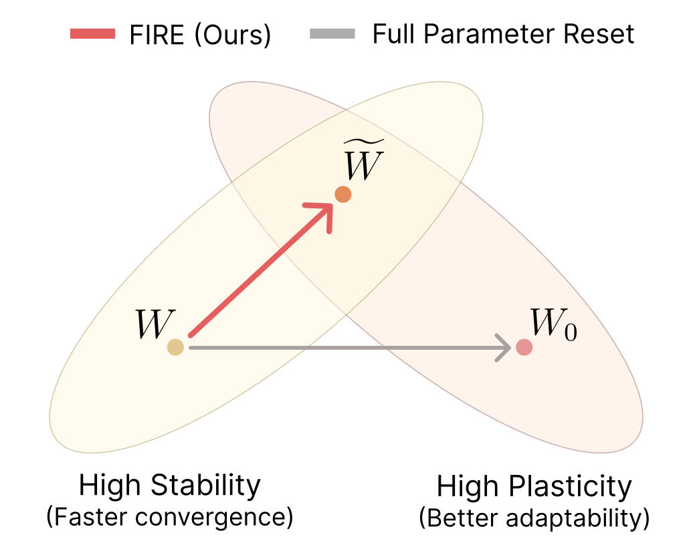

# 🔥 FIRE: Frobenius-Isometry Reinitialization for Balancing the Stability-Plasticity Tradeoff

This repository contains the code for the paper:  
**"FIRE: Frobenius-Isometry Reinitialization for Balancing the Stability-Plasticity Tradeoff"**  
Authors: 
[Isaac Han](https://isaac7778.github.io/), 
Sangyeon Park, 
Seungwon Oh, 
[Donghu Kim](https://i-am-proto.github.io/),
[Hojoon Lee*](https://joonleesky.github.io/), 
[Kyung-Joong Kim*](https://cilab.gist.ac.kr/hp/current-member/)

Accepted at ICLR 2026 (Oral presentation - top ~1.5% of submissions)

<p align="left">
  
</p>

For more information, please see our [project webpage](https://isaac7778.github.io/fire/) and [paper](https://openreview.net/pdf?id=CfZLxT3zIZ)


## 📖 Codebase

As we conducted experiments in diverse domains (vision, language and RL), we used different settings for each of them. Please refer below to set up and run experiments:

#### Continual Visual Learning (Fig 2) > [vision/README.md](vision/README.md)

#### Continual Pretraining of LLMs (Fig 3) > [language/README.md](language/README.md)

#### Reinforcement Learning (Fig 4) > [rl/dqn/README.md](rl/dqn/README.md) and [rl/sac/README.md](rl/sac/README.md)

---

## 📄 Citation
If you find our work useful, please consider citing the paper as follows:
```
@article{han2026fire,
	title={FIRE: Frobenius-Isometry Reinitialization for Balancing the Stability-Plasticity Tradeoff},
	author={Isaac Han and Sangyeon Park and Seungwon Oh and Donghu Kim and Hojoon Lee and Kyung-Joong Kim},
	journal={International Conference on Learning Representations (ICLR)},
	year={2026}
}	
```
