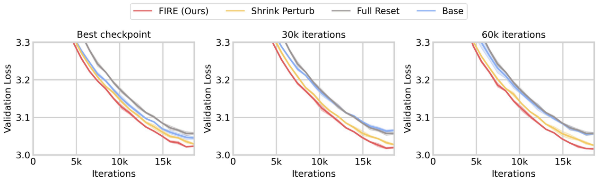

# Continual Pre-training of LLMs

Source code for continual pretraining of GPT-0.1B (Fig 3)

<p align="center">
  
</p>

Our codes are based on Karpathy's [nanogpt](https://github.com/karpathy/nanoGPT). 

## 📦 Installation

Install required pakages.
```
pip install torch numpy transformers datasets tiktoken wandb tqdm
```

Download datasets.
```
python data/openwebtext/prepare.py
python data/wikitext/prepare.py
```


## ▶️ Run
Run main script using command below.
```
torchrun --standalone --nproc_per_node=[number of GPUs] train.py \
 --method_type=[method name] \
 --c0_dataset=[warm-starting dataset name]
 --c1_dataset=[fine-tuning dataset name]
```

Available method names: ```[vanilla, full_reset, snp, fire]```

Available dataset names: ```[wikitext, openwebtext, wiki_owt]``` 

(```wiki_owt``` refers combination of ```wikitext``` and ```openwebtext```)

## 📊 Reproductions
We assume you have 8X A100 40GB node. Run this script to reproduce figure 3.
```
bash warm_start_gpt.sh
```