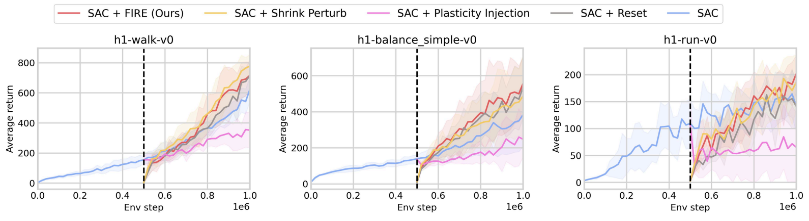

# Reinforcement Learning (HumanoidBench)

Source code for SAC HumanoidBench plasticity experiment (Fig. 4(b))

<p align="center">
  
</p>

This project is built upon the [Simba](https://github.com/SonyResearch/simba) codebase. It implements a two-stage SAC training pipeline for HumanoidBench, designed to study various neural network plasticity and reset techniques applied at the midpoint of training.

## 📦 Installation

### Pip/Conda
Install dependencies using pip or conda
```
# Use pip
pip install -e .

# Or use conda
conda env create -f deps/environment.yaml
```

Install Humanoid Bench

```
git clone https://github.com/isaac7778/humanoid-bench
cd humanoid-bench
pip install -e .
```

## 📊 Reproductions

```
bash scripts/save_and_load/simba_rr2_save500K.sh
bash scripts/save_and_load/simba_rr2_load500K_fire.sh
bash scripts/save_and_load/simba_rr2_load500K_reset.sh
bash scripts/save_and_load/simba_rr2_load500K_snp.sh
```
