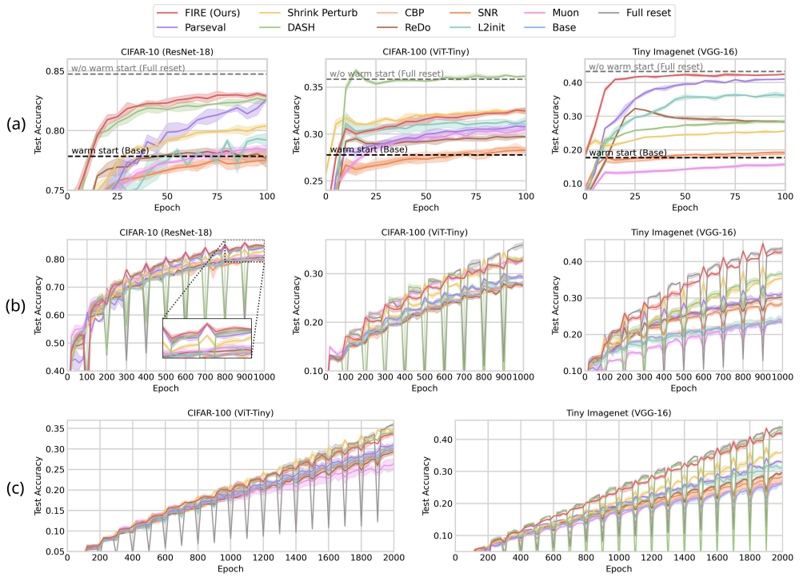

# Continual Visual Learning 

Source code for continual visual learning experiment (Fig 2)

<p align="center">
  
</p>


## 📦 Installation
To set up the environment for running the main scripts:

```
conda create -n pl_vision python=3.10 -y
conda activate pl_vision
pip install -r requirements.txt
```

Datasets will be downloaded automatically in ```/data``` if you execute the main script.

## ▶️ Run
Run main script using command below.
```
python train.py --benchmark [benchmark_name] --model [model_name] --task [dataset_name]
```

Available benchmarks: ```[warm_start, continunal, class_incremental]```

Available models: ```[RESNET18, TinyViT, VGG16]```

Available datasets: ```[CIFAR10, CIFAR100, TinyImageNet]```

Run with --help to see full configs including interventions.
```
python train.py --help
```

## 📊 Reproductions
For Figure 2 (a):
```
bash scripts/warm_start.sh 
```
For Figure 2 (b):
```
bash scripts/continual.sh 
```
For Figure 2 (c):
```
bash scripts/class_incremental.sh 
```